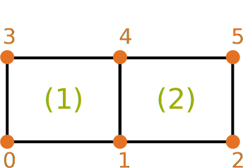
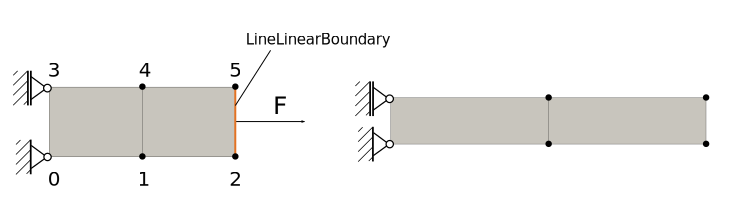

Boundary Conditions
===================

In general there are two types of boundary conditions one can impose on structures:

1. Dirichlet Boundary Conditions
2. Neumann Boundary Conditions

Dirichlet Boundary Conditions impose displacements on certain degrees of freedom.
Neumann Boundary Conditions impose forces on certain degrees of freedom.

There is a third kind of condition which is similar to Dirichlet Boundary Conditions: Constraints.
In AMfe constraints are treated similarly to Dirichlet Boundary Conditions.
They are applied by elimination technique.

This guide shows how boundary conditions and constraints can be imposed in AMfe.

.. note::

    This guide goes a bit in detail how AMfe treats boundary conditions. If you only want to know how to impose the
    boundary conditions in a convenient way, then it is recommended to read the guide about mechanical_system module
    instead.

How Dirichlet Boundary Conditions and Constraints are organized
---------------------------------------------------------------

The main class to handle Dirichlet Boundary Conditions is
:py:class:`DirichletBoundary<amfe.boundary.DirichletBoundary>`.
However, there are also two properties in the
:py:class:`Mesh<amfe.mesh.Mesh>`-class that help to define Dirichlet Boundary Conditions.
Table :numref:`tab_diric_properties` gives an overview over the properties that can be set to define
Dirichlet Boundary conditions and linear, holonomic, skleronomic, homogene constraints.

.. _tab_diric_properties:

.. table:: Important properties that control the dirichlet boundary conditions and constraints

    +-----------------------------------------------------------------------------------------------------------------+------------------------------------------------------------------------------------------------------------------------+
    | Property                                                                                                        | Description                                                                                                            |
    +=================================================================================================================+========================================================================================================================+
    | :py:attr:`Mesh.nodes_dirichlet<amfe.mesh.Mesh.nodes_dirichlet>`                                                 | Contains a unique set of all node-ids where Dirichlet boundary conditions are imposed to                               |
    +-----------------------------------------------------------------------------------------------------------------+------------------------------------------------------------------------------------------------------------------------+
    | :py:attr:`Mesh.dofs_dirichlet<amfe.mesh.Mesh.dofs_dirichlet>`                                                   | Contains a unique set of all global dof-ids where Dirichlet boundary conditions are imposed to                         |
    +-----------------------------------------------------------------------------------------------------------------+------------------------------------------------------------------------------------------------------------------------+
    | :py:attr:`DirichletBoundary.slave_dofs<amfe.boundary.DirichletBoundary.slave_dofs>`                             | Contains the constrained dofs                                                                                          |
    +-----------------------------------------------------------------------------------------------------------------+------------------------------------------------------------------------------------------------------------------------+
    | :py:attr:`DirichletBoundary.B<amfe.boundary.DirichletBoundary.B>`                                               | A mapping matrix between the free dofs of the unconstrained and the constrained system                                 |
    +-----------------------------------------------------------------------------------------------------------------+------------------------------------------------------------------------------------------------------------------------+
    | :py:attr:`DirichletBoundary.no_of_constrained_dofs<amfe.boundary.DirichletBoundary.no_of_constrained_dofs>`     | Contains the number of free dofs of the constrained system                                                             |
    +-----------------------------------------------------------------------------------------------------------------+------------------------------------------------------------------------------------------------------------------------+
    | :py:attr:`DirichletBoundary.no_of_unconstrained_dofs<amfe.boundary.DirichletBoundary.no_of_unconstrained_dofs>` | Contains the number of dofs of the unconstrained system (all dofs when no constraints were imposed)                    |
    +-----------------------------------------------------------------------------------------------------------------+------------------------------------------------------------------------------------------------------------------------+
    | :py:attr:`DirichletBoundary.row<amfe.boundary.DirichletBoundary.row>`                                           | row indices of (row,col,val)-triplet of constraint matrix C (only needed for systems with multipoint constraints)      |
    +-----------------------------------------------------------------------------------------------------------------+------------------------------------------------------------------------------------------------------------------------+
    | :py:attr:`DirichletBoundary.col<amfe.boundary.DirichletBoundary.col>`                                           | column indices of (row,col,val)-triplet of constraint matrix C (only needed for systems with multipoint constraints)   |
    +-----------------------------------------------------------------------------------------------------------------+------------------------------------------------------------------------------------------------------------------------+
    | :py:attr:`DirichletBoundary.val<amfe.boundary.DirichletBoundary.val>`                                           | values of (row,col,val)-triplet of the constraint matrix C (only needed for systems with multipoint constraints        |
    +-----------------------------------------------------------------------------------------------------------------+------------------------------------------------------------------------------------------------------------------------+

Dirichlet boundary conditions are set if the first six properties are set properly.
If constraints are also imposed, then row, col and val attributes are also needed.

The B-Matrix
^^^^^^^^^^^^

The heart of Dirichlet Boundary Conditions and Constraints is the B-matrix which is stored in the
:py:attr:`B<amfe.boundary.DirichletBoundary.B>`-property.
This matrix maps all dofs of the full mesh i.e. all dofs of the unconstrained system to the remaining dofs of the
constrained system.
The remaining dofs i.e. the dofs of the constrained system are called master-dofs. The other dofs i.e. the eliminated
dofs are called slave-dofs.
Therefore the relation

.. math::

    u_{unconstrained system} = B \ u_{constrained system} \quad \text{oder} \quad
    \begin{bmatrix}
    u_{master} \\ u_{slave} \end{bmatrix} = B \  u_{master}

The constraints can then be imposed very simply to e.g. the stiffness matrix by

.. math::

    K_{constrained} = B^T \, K \, B

This can be done by calling the method
:py:meth:`DirichletBoundary.constrain_matrix(Matrix)<amfe.boundary.DirichletBoundary.constrain_matrix>`::

    >>> dic.constrain_matrix(K_unconstrained)

If one wants to constrain a vector such as the nonlinear restoring force one suich that

.. math::

    f_{constrained} = B^T \, f

one calls
:py:meth:`DirichletBoundary.constrain_vec(vector)<amfe.boundary.DirichletBoundary.constrain_vec>`::

    >>> dic.constrain_vec(f_unconstrained)

The B matrix is generated such that

.. math::

    \begin{bmatrix} \vec u_{master} \\
    \vec u_{slave}
    \end{bmatrix}
    =
    \begin{bmatrix} 1 & 0 \\
    C & 1
    \end{bmatrix}
    \begin{bmatrix}
    \vec u_{master} \\
    \vec u_{slave}
    \end{bmatrix}

where C is the constraint matrix (see sections below) and afterwards the columns stored in the
:py:attr:`DirichletBoundary.slave_dofs<amfe.boundary.DirichletBoundary.slave_dofs>`-property
are dropped. One gets the relation

.. math::

    \begin{bmatrix} \vec u_{master} \\ \vec u_{slave} \end{bmatrix}
    =
    \underbrace{\begin{bmatrix} 1 \\ C \end{bmatrix}}_B
    \vec u_{master}

The matrix B is stored in the :py:attr:`B<amfe.boundary.DirichletBoundary.B>`-property of the DirichletBoundary-class.
It can be updated by using the :py:meth:`DirichletBoundary.update()<amfe.boundary.DirichletBoundary.update>`-method or can be returned
by calling :py:meth:`DirichletBoundary.b_matrix()<amfe.boundary.DirichletBoundary.b_matrix>`-method.

If one wants to get the full displacement vector of all dofs from the displacement of the master-dofs one can call
:py:meth:`DirichletBoundary.unconstrain_vec(u)<amfe.boundary.DirichletBoundary.unconstrain_vec>` which returns
:math:`B \cdot u`.

Dirichlet Boundary Conditions
-----------------------------

Applying Dirichlet Boundary Condition is usually done in two steps:

1. Set the properties of the mesh class (:py:attr:`Mesh.nodes_dirichlet<amfe.mesh.Mesh.nodes_dirichlet>`, :py:attr:`Mesh.dofs_dirichlet<amfe.mesh.Mesh.dofs_dirichlet>`)
2. Create a DirichletBoundary object and assign its properties (:py:attr:`DirichletBoundary.slave_dofs<amfe.boundary.DirichletBoundary.slave_dofs>`,
    :py:attr:`DirichletBoundary.B<amfe.boundary.DirichletBoundary.B>`, :py:attr:`DirichletBoundary.no_of_constrained_dofs<amfe.boundary.DirichletBoundary.no_of_constrained_dofs>`,
    :py:attr:`DirichletBoundary.no_of_unconstrained_dofs<amfe.boundary.DirichletBoundary.no_of_unconstrained_dofs>`)

Example - The hard way
^^^^^^^^^^^^^^^^^^^^^^

In this example we show the deepest way to assign Dirichlet boundary conditions in AMfe.
It is shown that setting the first six properties shown in :numref:`tab_diric_properties` is sufficient to apply Dirichlet boundary
conditions. Consider the following example:

.. _simple_geo_dbc:

  Simple mesh-geometry

:numref:`simple_geo_dbc` shows a simple mesh-geometry with two elements and 6 nodes.

We want to fix node 0 in x- and y-direction and node 3 in x-direction. Due to the node numbering convention in AMfe,
these degrees of freedom have the IDs 0,1 and 6.
If not already done, we need to define the mesh and initialize a DirichletBoundary instance::

    >>> msh = amfe.Mesh()
    >>> ... # Several operations to define the mesh above...
    >>> dic = amfe.DirichletBoundary()

Then the first step is setting the properties of the Mesh-class::

    >>> msh.nodes_dirichlet = np.array([0,3])
    >>> msh.dofs_dirichlet = np.array([0,1,6])

The second step is setting the properties of the DirichletBoundary class::

    >>> dic.slave_dofs = msh.dofs_dirichlet
    >>> dic.update()

The method :py:meth:`DirichletBoundary.update()<amfe.boundary.DirichletBoundary.update>` updates the properties
:py:attr:`DirichletBoundary.B<amfe.boundary.DirichletBoundary.B>`
:py:attr:`DirichletBoundary.no_of_constrained_dofs<amfe.boundary.DirichletBoundary.no_of_constrained_dofs>`
:py:attr:`DirichletBoundary.no_of_unconstrained_dofs<amfe.boundary.DirichletBoundary.no_of_unconstrained_dofs>`.

Although this is a quite hard way to impose Dirichlet Boundary conditions, it could still be helpful because the more
convenient ways require that the Dirichlet Boundary conditions have to be imposed on elements that belong to the same
physical group that is defined in the :py:attr:`Mesh.el_df<amfe.mesh.Mesh.el_df>`-property.

Example - The more convenient way
^^^^^^^^^^^^^^^^^^^^^^^^^^^^^^^^^

The same steps can be done in a more convenient way if a mesh-property (a physical group is avilable).
The first step i.e. setting the mesh properties :py:attr:`Mesh.nodes_dirichlet<amfe.mesh.Mesh.nodes_dirichlet>` and
:py:attr:`Mesh.dofs_dirichlet<amfe.mesh.Mesh.dofs_dirichlet>` can be done by calling the method
:py:meth:`set_dirichlet_bc<amfe.mesh.Mesh.set_dirichlet_bc>`::

    >>> msh.set_dirichlet_bc(101,'xy')

The first argument of the method is the physical group of the mesh where the boundary condition shall be assigned to.
The second argument is a string that contains the coordinates (directions) where the boundary condition shall be
assigned to. After calling this method both properties are extended by those degrees of freedom that belong to the
passed physical group and the coordinates.

The second step i.e. setting propeties of the DirichletBoundary class can be done by calling::

    >>> dic.constrain_dofs(msh.dofs_dirichlet)

.. note::

  The most convenient way to apply dirichlet boundary conditions is to use the mechanical_sytem class and its
  method :py:meth:`apply_dirichlet_boundaries<amfe.mechanical_system.MechanicalSystem.apply_dirichlet_boundaries>`.

Option 'External'
^^^^^^^^^^^^^^^^^
The method :py:meth:`set_dirichlet_bc<amfe.mesh.Mesh.set_dirichlet_bc>`
has the option output='external'.
If this option is set, the method returns the nodes and dofs that would be fixed if the Dirichlet boundary condition
**would** be applied. In fact the boundary condition is not applied.
The returned values can be used for further more complicated steps. This can be helpful e.g. for applying
constraints (see section below).

In the following example we fix the dofs that belong to physical group 101 in two steps::

    >>> msh = amfe.Mesh()
    >>> ... # Several operations to define the mesh topology...
    >>> nodes, dofs = msh.set_dirichlet_bc(101,output='external')
    >>> dic.constrain_dofs(dofs)

Applying constraints
---------------------

The main or deepest function to apply constraints to the system is
:py:meth:`DirichletBoundary.add_constraints(slave_dofs, row, col, val)<amfe.boundary.DirichletBoundary.add_constraints>`.
This function can apply holonomic, skleronomic, homogene constraints of the following kind:

.. math::

    \vec u_{slave} = C \ \vec u_{master}

For example run::

    >>> dic.add_constraints([21,22],[21,22],[25 25],[1 1])

The method expects (slave_dofs, row, col, val) for describing the entries of the C matrix.
The first argument slave_dofs is a list of dof-ids that shall function as slave-dofs.
The (row, col, val) triple describes the entries of the sparse C matrix.
Therefore col consists of ids of master-dofs.

.. warning::

    One can call the method
    :py:meth:`DirichletBoundary.add_constraints<amfe.boundary.DirichletBoundary.add_constraints>`
    several times. Then the new values for row, col and val are added to the ones before.
    You have to be careful if a (row, col)-pair has already been set. Then you will see unexpected behavior.

The B matrix is generated such that

.. math::

    \begin{bmatrix} \vec u_{master} \\
    \vec u_{slave}
    \end{bmatrix}
    =
    \begin{bmatrix} 1 & 0 \\
    C & 1
    \end{bmatrix}
    \begin{bmatrix}
    \vec u_{master} \\
    \vec u_{slave}
    \end{bmatrix}

and afterwards the slave dofs-columns are dropped and one gets the relation

.. math::

    \begin{bmatrix} \vec u_{master} \\ \vec u_{slave} \end{bmatrix}
    =
    \underbrace{\begin{bmatrix} 1 \\ C \end{bmatrix}}_B
    \vec u_{master}

The matrix B is stored in the :py:attr:`B<amfe.boundary.DirichletBoundary.B>`-property of the DirichletBoundary-class.

More convenient way - the master-slave list
^^^^^^^^^^^^^^^^^^^^^^^^^^^^^^^^^^^^^^^^^^^

There is a more convenient way to apply constraints that relate several slave degrees of freedom to only one
master degree of freedom by using the
:py:meth:`apply_master_slave_list()<amfe.boundary.DirichletBoundary.apply_master_slave_list>`-method.
This method expects one argument, a so called master-slave-list.
The type of this argument is a list that contains triplets of master-slave-relations.
One triplet consists of

1. integer: a master-dof
2. list: slave-dofs
3. ndarray: weighting-matrix

Then the relation :math:`u_{slave} = W^T \, u_{master}` is imposed to the system where W is the weighting matrix.
If None is used for the weighting matrix, then all dofs are weighted by one

The following example shows how x-direction of all dofs belonging to physical group 101 can be equalized::

    >>> nodes, dofs = msh.set_dirichlet_bc(101,'x',output='external')
    >>> dic.apply_master_slave_list([[dofs[0], dofs[1:], None],])

In the example above the option 'external' is used to get all global dofs which belong to x-direction and
to the physical group with id 101. Afterwards the first returned dof is taken as master_dof and the rest as slave-dofs.

Neumann Boundary Conditions
---------------------------

Neumann Boundary conditions in structural dynamics represent external forces.

How Neumann Boundary Conditions are organized in AMfe
^^^^^^^^^^^^^^^^^^^^^^^^^^^^^^^^^^^^^^^^^^^^^^^^^^^^^

Neumann boundary conditions are implemented by
:py:class:`BoundaryElement<amfe.element.BoundaryElement>` s.
These elements are very similar to simple elements of the continuum. They are assembled like the continuum elements.
However typically their shape is one dimension lower than the dimension of the problem.

In detail one have to do two steps to apply Neumann boundary conditions:

1. Define the boundary elements that represent the forces one want to impose.
2. Update the assembly information by calling
   :py:meth:`Assembly.compute_element_indices<amfe.assembly.Assembly.compute_element_indices>`

Both steps can be done easily by using the method
:py:meth:`MechanicalSystem.apply_neumann_boundaries()<amfe.mechanical_system.MechanicalSystem.apply_neumann_boundaries>`
This is explained in the section about the MechanicalSystem fundamentals.

The following section goes more in detail in how AMfe processes Neumann Boundary conditions and how the first step
i.e. defining boundary elements can be done.

Boundary Elements
^^^^^^^^^^^^^^^^^

In AMfe so called boundary elements are used to apply Neumann boundary conditions. They are processed similar to
continuum elements and are assembled like them. The assembly method for the boundary elements is
:py:meth:`Assembly.assemble_k_and_f_neumann()<amfe.assembly.Assembly.assemble_k_and_f_neumann>`.
This function assembles all elements that are defined in the associated mesh. Their definition is stored in the
:py:attr:`Mesh.neumann_connectivity<amfe.mesh.Mesh.neumann_connectivity>` and
:py:attr:`Mesh.neumann_obj<amfe.mesh.Mesh.neumann_obj>` property.

Similar to the continuum elements, the :py:attr:`Mesh.neumann_obj<amfe.mesh.Mesh.neumann_obj>` property
stores pointers to instances of NeumannBoundary classes.
While for continuum elements one needs one instance for each type of element and material, one needs
for Neumann elements one instance for each type of Neumann element and boundary condition definition e.g. for each
different time dependence, scale values etc.

:numref:`tab_boundary_element_properties` lists the properties of boundary elements.

.. _tab_boundary_element_properties:

.. table:: Important properties of Boundary Elements

    +-----------------------------------------------------------------------------------------------------------------+------------------------------------------------------------------------------------------------------------------------+
    | Property                                                                                                        | Description                                                                                                            |
    +=================================================================================================================+========================================================================================================================+
    | :py:attr:`f_proj<amfe.element.BoundaryElement.f_proj>`                                                          | Contains a function that returns the local force vector for assembly when f_mat and direction is given                 |
    +-----------------------------------------------------------------------------------------------------------------+------------------------------------------------------------------------------------------------------------------------+
    | :py:attr:`time_func<amfe.element.BoundaryElement.time_func>`                                                    | Contains a function that amplifies the applied force value over time                                                   |
    +-----------------------------------------------------------------------------------------------------------------+------------------------------------------------------------------------------------------------------------------------+
    | :py:attr:`val<amfe.element.BoundaryElement.val>`                                                                | Scale factor for applied force                                                                                         |
    +-----------------------------------------------------------------------------------------------------------------+------------------------------------------------------------------------------------------------------------------------+
    | :py:attr:`direct<amfe.element.BoundaryElement.direct>`                                                          | direction of applied force given as vector in global coordinate system or set as 'normal' for forces normal to surface |
    +-----------------------------------------------------------------------------------------------------------------+------------------------------------------------------------------------------------------------------------------------+
    | :py:attr:`f<amfe.element.BoundaryElement.f>`                                                                    | local external force vector for assembly                                                                               |
    +-----------------------------------------------------------------------------------------------------------------+------------------------------------------------------------------------------------------------------------------------+
    | :py:attr:`K<amfe.element.BoundaryElement.K>`                                                                    | local external tangent stiffness matrix (typically zero for boundary elements)                                         |
    +-----------------------------------------------------------------------------------------------------------------+------------------------------------------------------------------------------------------------------------------------+
    | :py:attr:`M<amfe.element.BoundaryElement.M>`                                                                    | local external mass matrix (typically zero for boundary elements)                                                      |
    +-----------------------------------------------------------------------------------------------------------------+------------------------------------------------------------------------------------------------------------------------+

Convenient way - Using the set_neumann_bc-method
^^^^^^^^^^^^^^^^^^^^^^^^^^^^^^^^^^^^^^^^^^^^^^^^

If the Neumann boundary conditions should act on all elements that belong to a certain physical group, the definition
of the boundary elements is quite easy. We can use the method
:py:meth:`Mesh.set_neumann_bc()<amfe.mesh.Mesh.set_neumann_bc>`.

This method expects the following parameters:

.. _tab_parameters_set_neumann_bc:

.. table:: Parameters for the method set_neumann_bc

    +-----------------------------------+-------------------------------------------------------------------------------------------------------------------------------------------+
    | key                               | value                                                                                                                                     |
    +===================================+===========================================================================================================================================+
    | key                               | key of mesh property e.g. id of physical group where neumann boundary condition should be applied                                         |
    +-----------------------------------+-------------------------------------------------------------------------------------------------------------------------------------------+
    | val                               | scale factor for applied force                                                                                                            |
    +-----------------------------------+-------------------------------------------------------------------------------------------------------------------------------------------+
    | direct                            | direct = 'normal' (default) or numpy vector that shows in the direction where the force has to be applied                                 |
    +-----------------------------------+-------------------------------------------------------------------------------------------------------------------------------------------+
    | time_func=None (optional)         | time_func = function dependent on a parameter t which amplifies applied force over time                                                   |
    +-----------------------------------+-------------------------------------------------------------------------------------------------------------------------------------------+
    | shadow_area=False (optional)      | boolean value. False: force is proportional to full current area. True: force is proportional to on passed vector 'direct' projected area |
    +-----------------------------------+-------------------------------------------------------------------------------------------------------------------------------------------+
    | mesh_prop='phys_group' (optional) | chooses mesh property the parameter 'key' belongs to                                                                                      |
    +-----------------------------------+-------------------------------------------------------------------------------------------------------------------------------------------+

Example: Apply Neumann Boundary condition on physical group number 105 in x direction growing linearly in 2 seconds up to 150 per length unit::

    >>> msh = Mesh()
    >>> # mesh operations to define mesh ...
    >>> def linear_func(t):
    >>>     return t/2
    >>>
    >>> msh.set_neumann_bc(105,150,numpy.array([1,0]),time_func=linear_func)
    >>> asm.compute_element_indices()

Hard way - Defining boundary elements by hand
^^^^^^^^^^^^^^^^^^^^^^^^^^^^^^^^^^^^^^^^^^^^^

.. _simple_neumann_manually:

  Neumann

:numref:`simple_neumann_manually` shows.

Example: Define LineLinearBoundary-Element between nodes 2 and 5 with linear increasing value up to 10 per length unit
and acting in x-direction::

    >>> msh.neumann_connectivity=[np.array([2,5])]
    >>> msh.neumann_obj = [amfe.LineLinearBoundary(val=10,direct=(1,0), time_func = lambda t: t)]
    >>> asm.compute_element_indices()

Mesh-Tying
----------

.. todo::

    This is not documented yet. See documentation of the :py:mod:`mesh_tying<amfe.mesh_tying>` module and
    :py:meth:`Mesh.tie_mesh<amfe.mesh.Mesh.tie_mesh>`.