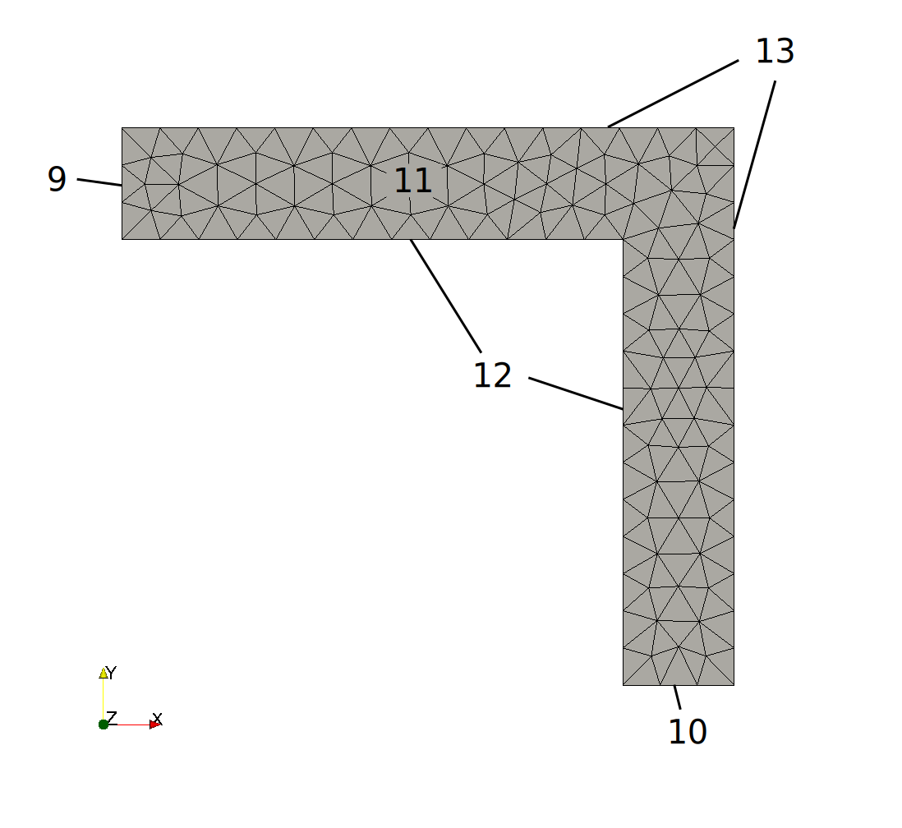
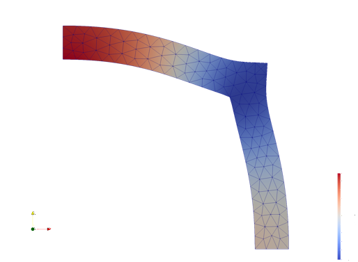

Tutorial 1: Static Problem - Pressure Corner
============================================

In this tutorial we want to walk through a full simulation process which is presented in the example
"pressure_corner.py".
It covers the mesh-import and the creation-process of a new material. You will learn some basic features how to use the
:py:mod:`amfe.component`
class which wraps all information about your problem. Furthermore, you will learn how to add Dirichlet and
Neumann conditions to the problem and distinguish between Component and MechanicalSystem.
We will only use methods provided in the module
:py:mod:`amfe.ui`,
which is the simplest User Interface (UI) for AMfe. It provides some common methods you'll need to perform a full
Finite Elements simulation.

We’ll assume, you have AMfe installed already.

Problem
-------

The provided mesh is shown in Figure :numref:`pcmesh`.
The edges with physical group numbers 9 and 10
are enforced to move only in y and x direction, respectively. At group 12, a given force in normal
direction to the surface with magnitude :math:`F = 10^7` is applied. For nonlinear analyses (large deflections)
we must apply this force in small steps. This is done using the time-dependent
function :math:`F = 10^7 \cdot t`.

.. _pcmesh:

  Mesh of pressure corner.

:numref:`pcmesh` shows a meshed 2D corner. It is meshed by the open source
software `Gmsh <http://gmsh.info/>`_.
You can find the Mesh-File in AMfe's *examples* folder.
Every edge and every surface are associated with a physical-group-number.
The surface of the corner has the physical-group-number 11.
The small edges belong to physical group numbers 9 and 10, and the outer and inner edges
belong to physical group numbers 13 and 12, respectively.

Solving problem with AMfe
-------------------------

Preparation
^^^^^^^^^^^^

For setting up a new simulation, first import the AMfe-UI to your namespace::

  import amfe.ui

We save relative paths for the provided mesh-file in variables. The input_file will be used as the absolute path where
the provided mesh-geometry is stored. The output_file is the full path to the file were the Paraview results shall
be written. If we use the AMfe folder as working directory, we can call :py:meth:`amfe.io.tools.amfe_dir` which directly
returns the absolute path of the filename given relative to the AMfe directory::

  from amfe.io import amfe_dir
  input_file = amfe_dir('meshes/gmsh/pressure_corner.msh')
  output_file_deformation = amfe_dir('results/pressure_corner/pressure_corner_linear_deformation')
  output_file_modes = amfe_dir('results/pressure_corner/pressure_corner_linear_modes')

The output file must be entered without file-extension.

Load Mesh
^^^^^^^^^

Next, we have to load the mesh-information and store it in the workspace.
This can be done by the
:py:class:`amfe.ui.import_mesh_from_file` method. Therefore, we run::

  my_mesh = amfe.ui.import_mesh_from_file(input_file)

Setting up new component
^^^^^^^^^^^^^^^^^^^^^^^^^

The Component object will later contain all information about your simulation.
This includes the mesh information, materials, boundary conditions, etc..
In order to create a component and directly associate it with the previously loaded mesh, we use the
:py:meth:`amfe.ui.create_structural_component` method::

  my_component = amfe.ui.create_structural_component(my_mesh)

Define materials and assign it to component
^^^^^^^^^^^^^^^^^^^^^^^^^^^^^^^^^^^^^^^^^^^^

First, we create an instance of a material. For that, we use the method
:py:meth:`amfe.ui.create_material`::

    my_material = amfe.ui.create_material('Kirchhoff', E=210E9, nu=0.3, rho=7.86E3, plane_stress=True, thickness=0.1)

This defines a `St.-Venant-Kirchhoff`-Material with the selected parameters for
steel and a thickness of 1 mm. The `plane_stress`-flag means that there are no forces in the third space dimension
(out of plane) assumed.

Then, the material needs to be assigned to the component by using the method
:py:meth:`amfe.ui.assign_material_by_group`. We type::

    amfe.ui.assign_material_by_group(my_component, my_material, 11)

This specifies the component (here: `my_component`) in which the selected material (here: `my_material`)
will be assigned for specific physical group numbers (here: `11`). According to Figure :numref:`pcmesh`, the physical
group numbers 11 belongs to the surface of the whole corner.

Apply boundary conditions
^^^^^^^^^^^^^^^^^^^^^^^^^

In general, there are two different types of boundary conditions:

* Dirichlet boundary conditions (given displacements)
* Neumann boundary conditions (given stresses)

As stated in problem section, the edges with physical group numbers 9 and 10
are enforced to only move in y and x direction, respectively.
Therefore, we want to define two Dirichlet boundary conditions which can be
applied by
:py:meth:`amfe.ui.set_dirichlet_by_group` ::

  amfe.ui.set_dirichlet_by_group(my_component, 9, 'ux', 'Dirichlet0')
  amfe.ui.set_dirichlet_by_group(my_component, 10, 'uy', 'Dirichlet1')

These statements assign two Dirichlet-Constraints to `my_component` at the physical
group numbers 9 and 10 of the mesh. The
`direction` describes the fields where the physical groups should be constrained. As an example, Dirichlet0 ensures
that physical group 9 does not move in x-direction. For that, tuples with strings are used.
In order to provide a significant description of each Dirichlet constraint, the user can define the `constraint_name`.

A Neumann boundary condition is needed to apply the normal forces on the
inner edges of the corner. This can be done by
:py:meth:`amfe.ui.set_neumann_by_group` ::

  amfe.ui.set_neumann_by_group(my_component, 12, 'normal', following=True, neumann_name='Neumann0', f=lambda t: 1E7*t)

This statement assigns one Neumann condition at physical group numbers 12 of the mesh in `my_component`.
The force is `normal` to the surface and tagged
with a user-specified name. The following flag means that the force direction is following the normal
during deflection. The function f describes the (time-dependent) force.

Translate the Component to a MechanicalSystem
^^^^^^^^^^^^^^^^^^^^^^^^^^^^^^^^^^^^^^^^^^^^^^

In AMfe, we use two steps to describe a mechanical problem:

* StructuralComponent: Only describes the problem consisting of mesh, materials, mapping, constraints and boundary conditions
* MechanicalSystem and ConstraintFormulation: The MechanicalSystem describes the problem as a second order system of the type :math:`M \ddot{x} + f_{int}(x, \dot x, t) = f_{ext}`
which can be handed to a solver. The ConstraintFormulation determines how defined constraints are applied to the component numerically to gain
a MechanicalSystem object

Until now, we have worked on a StructuralComponent, but for linear or nonlinear solving, we need to translate it to
a Mechanical System (:py:class:`amfe.solver.translators.MechanicalSystem`) and a constraint formulation for
the constraints
(:py:class:`amfe.constraint.constraint_formulation_boolean_elimination.BooleanEliminationConstraintFormulation`).
Note, that after translation an intuitive change of material, constraints, or forces is not possible anymore.

We type::

    my_system, my_formulation = amfe.ui.create_mechanical_system(my_component)

Solve and write deformation analysis
^^^^^^^^^^^^^^^^^^^^^^^^^^^^^^^^^^^^^^

At this point the problem is entirely defined and is ready for the analysis. We start with the deformation.
The function
:py:meth:`amfe.ui.solve_nonlinear_static`
solves the static problem and stores it in `my_solution`, which is an instance of the
:py:class:`amfe.solver.solution.AmfeSolution` class::

  my_solution = amfe.ui.solve_nonlinear_static(my_system, my_formulation, 50)

The first parameter describes the `MechanicalSystem` including the `Formulation` to be solved.
The second parameter defines the `number of load steps` used for the solution.
This calculation can take some time, normally between one and five minutes. The solution is much faster when
the Fortran routines are installed.

There is an exporter for the open source postprocessing tool `Paraview <http://www.paraview.org/>`_ implemented, which
writes the solution of the component to a file.
The exporter is called by::

  amfe.ui.write_results_to_paraview(my_solution, my_component, output_file_deformation)

.. _pcmesh_deformation:

  Solution of the deformed mesh.

:numref:`pcmesh_deformation` shows a meshed 2D corner with the calculated deformation.

