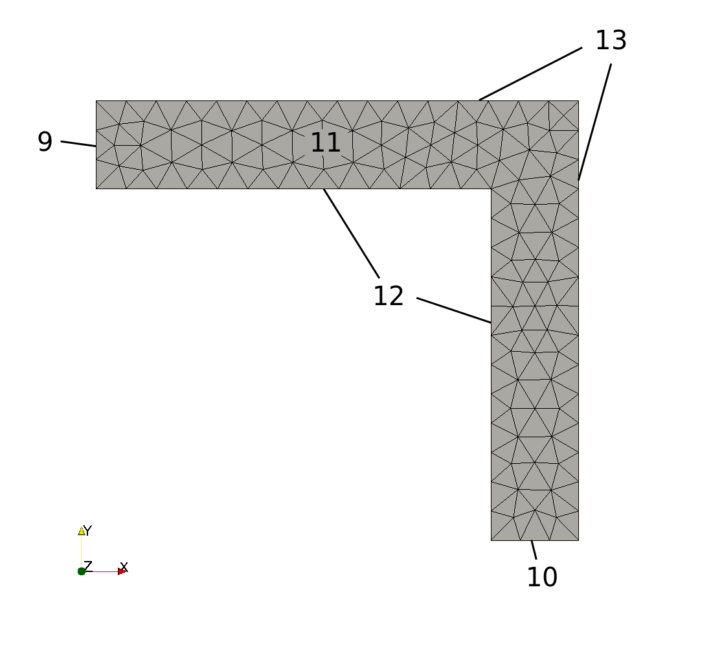
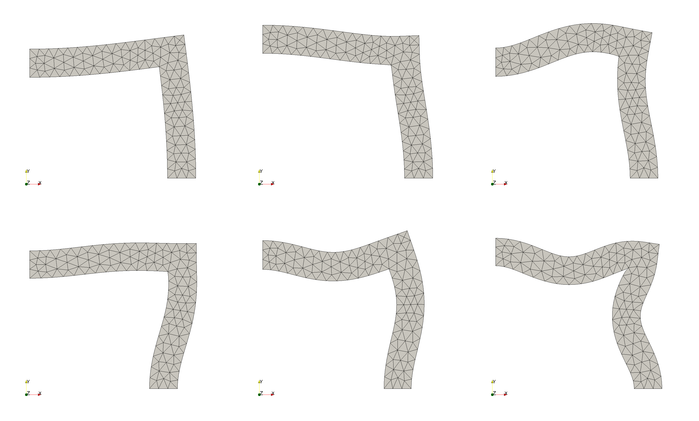

Tutorial 2: Modal Analysis
==========================

In this tutorial we want do a modal analysis. It is applied on the example
from the first tutorial. If you are not familiar with how to set up a
:py:class:`MechanicalSystem <amfe.solver.translators.MechanicalSystem>` instance,
new materials and meshes, it is recommended to read :doc:`tutorial_01` first.

Problem
-------

.. _pcmesh_02:

  Mesh of pressure corner.

:numref:`pcmesh_02` shows a meshed 2D corner. It is meshed by the open-source
software `Gmsh <http://gmsh.info/>`_.
You can find the Mesh-File in AMfe's *examples* folder.
Every edge and every surface is associated with a physical-group-number.
The surface of the corner has the physical-group-number 11.
The small edges belong to physical group 9 and 10, and the outer and inner edges
belong to physical group 13 and 12, respectively.

It is the same geometry as in :doc:`tutorial_01`.
Now we are not interested in a static solution for a given Neumann-boundary-condition.
We want to know the first ten eigenfrequencies of the pressure corner.

Solving the problem with AMfe
-----------------------------

Setting up new simulation, mesh and material
^^^^^^^^^^^^^^^^^^^^^^^^^^^^^^^^^^^^^^^^^^^^

As we have the same geometry, mesh and materials as in :doc:`tutorial_01`,
we enter the same commands::

    from amfe.io import amfe_dir
    import amfe.ui

    input_file = amfe_dir('meshes/gmsh/pressure_corner.msh')
    output_file_deformation = amfe_dir('results/pressure_corner/pressure_corner_nonlinear_deformation')
    output_file_modes = amfe_dir('results/pressure_corner/pressure_corner_linear_modes')

    # --- Load Mesh ---
    my_mesh = amfe.ui.import_mesh_from_file(input_file)

    # --- Setting up new component ---
    my_component = amfe.ui.create_structural_component(my_mesh)

    # --- Define materials and assign it to component ---
    my_material = amfe.ui.create_material('Kirchhoff', E=210E9, nu=0.3, rho=7.86E3, plane_stress=True, thickness=0.1)
    amfe.ui.assign_material_by_group(my_component, my_material, 11)

    # --- Apply boundary conditions ---
    amfe.ui.set_dirichlet_by_group(my_component, 9, 'ux', 'Dirichlet0')
    amfe.ui.set_dirichlet_by_group(my_component, 10, 'uy', 'Dirichlet1')

    # --- Translate the Component to a MechanicalSystem ---
    my_system, my_formulation = amfe.ui.create_mechanical_system(my_component)

.. note::
  In this example we do not apply any Neumann boundary conditions
  because they would not be considered in modal analysis.
  Modal analysis with prestress has not been implemented yet.

Solve
^^^^^
Solve and write modal analysis
^^^^^^^^^^^^^^^^^^^^^^^^^^^^^^^^

We can easily run a modal analysis with AMfe. Using the function :py:meth:`amfe.ui.solve_modes` with the arguments
`system`, `formulation` and `number of modes` we come to the modes which are stored in
a :py:class:`amfe.solver.solution.AmfeSolution` object::

    modes = amfe.ui.solve_modes(my_system, my_formulation, no_of_modes=10, hertz=True)

Here, `system` is an instance of the :py:class:`amfe.solver.translators.MechanicalSystem` and `formulation`
is an instance of
:py:class:`amfe.constraint.constraint_formulation_boolean_elimination.BooleanEliminationConstraintFormulation`.

We use the same function as we used before when we exported the deformation solution. But instead of 'my_solution'
we pass the 'modes'. Therefore, we type::

  amfe.ui.write_results_to_paraview(modes, my_component, output_file_modes)

As before, you can view the modal simulation using the open source postprocessing
tool `Paraview <http://www.paraview.org/>`_.
Note that the modes are separated using time steps, mode 1 is timestep 0, mode 2 is timestep 1 and so on.

Results
^^^^^^^

.. _tut2modes:

  First six modes of linearized pressure corner. Top: Modes 1-3, Bottom: Modes 4-6

:numref:`tut2modes` shows the first six modes of the linearized pressure corner.

As the eigenfrequencies are stored as timesteps in the amfesolution container we can get them by::

  print(modes.t)
  [  125.88198294,   296.66446201,   921.61100677,   994.45027039,
        1316.94610541,  1634.31575078,  2441.74646491,  2990.53919312,
        3530.41461115,  3688.88210744]

Next steps
^^^^^^^^^^^

When you’re comfortable with the basic functions in AMfe, read the next tutorial or try one of the examples provided
in the examples-folder. Or get familiar with the sourcecode of the methods in :py:class:`amfe.ui` as they basically
use main methods and classes provided in AMfe. The simplified usage gives you a good hint how to use AMfe and its
most powerful features. Therefore, the Module :py:mod:`amfe.ui` provides you an easy template to copy and modify
it in order to adapt it step by step to your problem.
